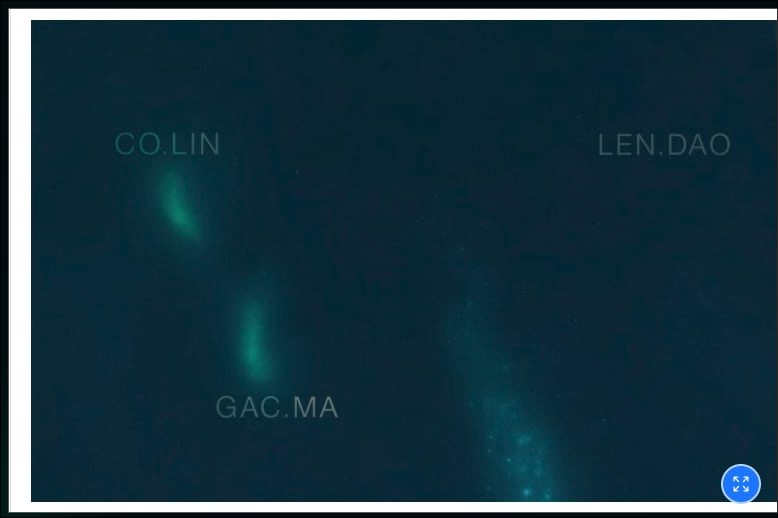
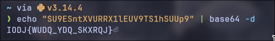
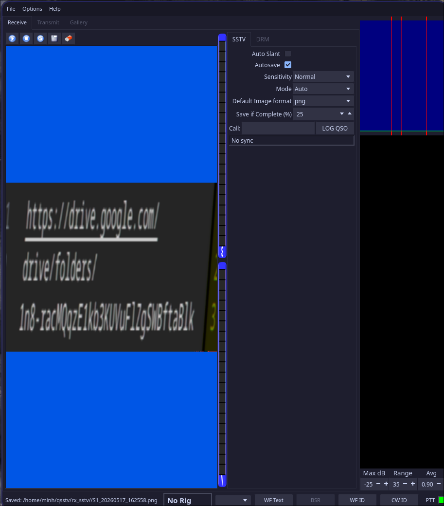
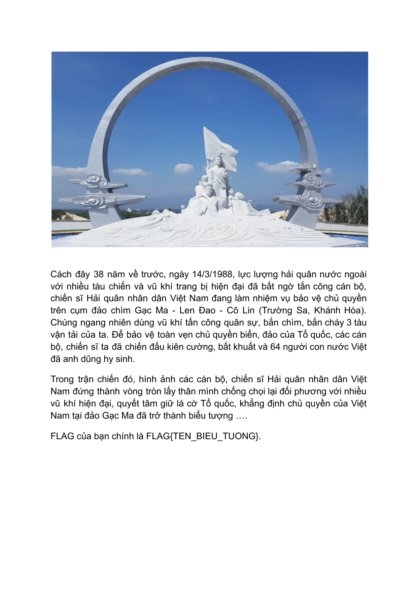
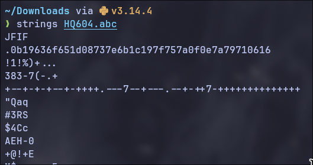
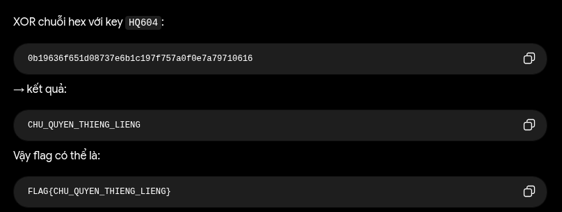

# Write-up Hold The Flag
## Lê Vũ Khánh Minh
---
### Bài 1:
- Nhận diện đây là một bài Crypto tìm x của bài toán  $h \equiv g^x \pmod p$ . Đây là bài toán loagrit rời rạc. Như vậy ta chỉ cần tìm được x và convert từ số sang byte thì ta sẽ thu được flag.
```python
p = 2247297901375864750461918215908397462554622316861885697469812609208482671796519989041708819088327406276727713325926984783654453580598954278480933663642628407743971547337698858815665335450301828703735517279088545252493204317839245564990751219121256870972082020870742841156981131437941510099651935803198999627
g = 797032223149531285607971355158192150926555680763341545661871333078567437408820428834941794887222745425244137303956776516613894961185972456200978813725184212858037439841778740577859187417009007458444768864113847557627519817788214445986970343968064264731545268364867143251499664214088696995903599781563984116
h = 468236306785559227242545208642961660487424736475509451324848496240713063884248400928453707063093512040762457493692466389598131256501402625717666645351148316070083773749717409678738689693550470750839264535543953759648092479282888291678698194889269011735062078161680411521433536665807130299043504305373037050

print("[*] Đang giải bài toán Logarit rời rạc (chờ một chút nhé)...")

F = GF(p)
g_F = F(g)
h_F = F(h)

x = discrete_log(h_F, g_F)

print(f"[*] Tìm thấy x = {x}")

# Decode bằng Python thuần
x_int = int(x)
flag_bytes = x_int.to_bytes((x_int.bit_length() + 7) // 8, byteorder='big')

try:
    print(f"\n[+] Flag: {flag_bytes.decode('utf-8')}")
except Exception as e:
    print(f"\n[!] Lỗi giải mã chuỗi. Raw bytes: {flag_bytes}")
```
- 🚩 FLAG{HQ604}
---
### Bài 2:
- Description:
    - Bên trong là một bức ảnh. Chụp từ trên cao, góc rộng — có thể thấy rõ những bãi san hô, những vùng biển nông xanh ngắt. Nhưng không có tên. Không có tọa độ. Như thể ai đó đã cố tình xóa đi mọi dấu vết.

    - Hay là — chưa xóa hết? Ở đây tối quá, chẳng nhìn thấy gì cả.

- Ta nhận được 1 file ảnh, tuy nhiên nội dung trong ảnh không rõ ràng. Kết hợp với đoạn mô tả, ta suy đoán rằng nếu căng chỉnh độ sáng hoặc độ tương phản của tấm ảnh thì sẽ thu được gì đó.



- Brute force thứ tự 3 cái tên xuất hiện thì ta sẽ thu được flag.
- 🚩 FLAG{GAC_MA_CO_LIN_LEN_DAO}
---
### Bài 3:
- Ta thấy 1 tấm ảnh với một dãy kí tự. Nhìn đặc điểm của dãy kí tự đó thì khả năng có chuỗi mà hóa base64. Ta thử decode base64 với chuỗi đó thì ta thu được một chuỗi kí tự khác



- Nhìn vào cấu trúc của chuỗi này, khả năng nó là Flag tuy nhiên đã bị mã hóa theo mật mã caesar với chữ I lùi 3 kí tự sẽ là chữ F. Như vậy ta chỉ cần lùi 3 kí tự với mỗi kí tự của dãy trên thì sẽ thu được flag.
- 🚩 FLAG{TRAN_VAN_PHUONG}
---
### Bài 4:
- Ta thu được 1 file audio với những tiếng tít khác chót tai (do ở tần số cao ). Khả năng đó là tiếng hiệu SSTV(Slow-Scan Television) thường được dùng để mã hóa 1 bức ảnh. Ta sẽ sử dụng công cụ 'qsstv' để ghi âm mà dịch đoạn âm thanh trên.



- Như ta đã dự đoán, ta nhận được 1 bức ảnh chứa đường link google drive. Thử truy cập vào đường link trên thì ta thu được 2 file bao gồm 1 file chall.py và 1 file output.txt
```python
import os
from Crypto.Cipher import AES

KEY = ?
class AES_CTR:
    def __init__(self, key, step_up=False):
        self.key = key
        self.cipher_core = AES.new(self.key, AES.MODE_ECB) 
        self.value = os.urandom(16).hex()
        self.step = 1
        self.stup = step_up

    def increment(self):
        if self.stup:
            self.newIV = hex(int(self.value, 16) + self.step)
        else:
            self.newIV = hex(int(self.value, 16) - self.stup) 
        self.value = self.newIV[2:len(self.newIV)]
        counter_block = bytes.fromhex(self.value.zfill(32))
        return self.cipher_core.encrypt(counter_block)

    def encrypt(self, data: bytes) -> bytes:
        out = bytearray()
        for i in range(0, len(data), 16):
            block = data[i:i+16]
            keystream = self.increment()
            xored = bytes(a ^ b for a, b in zip(block, keystream))
            out.extend(xored)
        return bytes(out)

def encrypt_challenge():
    cipher = AES_CTR(KEY, step_up=False)
    with open("flag.png", 'rb') as f:
        plaintext = f.read()
    ciphertext = cipher.encrypt(plaintext)
    encrypted_hex = ciphertext.hex()  
    with open("output.txt", 'w') as f:
        f.write(encrypted_hex)
encrypt_challenge()
``` 
- Nhờ AI đọc và tìm lỗ hổng thì ta biết được rằng khi khởi tạo AES_CTR, tác giả truyền vào step_up=False. Điều này đồng nghĩa với việc biến self.stup = False (tương đương với giá trị 0 trong toán học).Khi chạy vào hàm increment(), nhánh else sẽ được thực thi:self.newIV = hex(int(self.value, 16) - 0)Kết quả là self.newIV không bao giờ thay đổi giá trị! Bộ đếm (Counter) bị đứng im, dẫn đến việc cipher_core.encrypt(counter_block) luôn luôn tạo ra cùng một đoạn mã dòng (Keystream) dài 16 byte cho tất cả các block dữ liệu.Đây là lỗi Many-Time Pad (Tái sử dụng Keystream) cực kỳ kinh điển trong Cryptography. Tính chất của phép XOR cho chúng ta công thức sau:
- $Ciphertext = Plaintext \oplus Keystream$
$\Rightarrow Keystream = Ciphertext \oplus Plaintext$
- Như vậy ta chỉ cần viết 1 đoạn code phục hồi nội dung. Lưu ý phải lưu cùng địa chỉ với file output.txt.
```python
def decrypt_flag():
    print("[*] Bắt đầu giải mã...")
    
    # 1. Đọc nội dung file bị mã hóa
    try:
        with open("output.txt", "r") as f:
            ciphertext_hex = f.read().strip()
        ciphertext = bytes.fromhex(ciphertext_hex)
    except FileNotFoundError:
        print("[!] Không tìm thấy file output.txt. Đảm bảo file nằm cùng thư mục.")
        return

    # 2. Định nghĩa 16 bytes Magic Header chuẩn của một file PNG
    # Dấu hiệu nhận biết: \x89PNG\r\n\x1a\n...
    png_header = bytes.fromhex("89504e470d0a1a0a0000000d49484452")

    # 3. Lấy 16 byte đầu của Ciphertext
    c0 = ciphertext[:16]

    # 4. Tìm Keystream (Keystream = Ciphertext_block0 XOR Plaintext_block0)
    keystream = bytes(a ^ b for a, b in zip(c0, png_header))
    print(f"[*] Đã tìm thấy Keystream lặp: {keystream.hex()}")

    # 5. Khôi phục toàn bộ ảnh bằng cách XOR từng block 16 byte với Keystream
    plaintext = bytearray()
    for i in range(0, len(ciphertext), 16):
        block = ciphertext[i:i+16]
        # zip sẽ tự động dừng lại ở độ dài của block (giải quyết an toàn cho block cuối nếu < 16 bytes)
        decrypted_block = bytes(a ^ b for a, b in zip(block, keystream))
        plaintext.extend(decrypted_block)

    # 6. Ghi ra file ảnh gốc
    with open("flag_recovered.png", "wb") as f:
        f.write(plaintext)

    print("[+] Hoàn tất! Hãy mở file 'flag_recovered.png' để xem Flag của bạn.")

if __name__ == "__main__":
    decrypt_flag()
```
- Sau khi chạy đoạn code trên thì ta thu được 1 tấm ảnh chứ câu hỏi và bối cảnh của flag.



- 🚩 FLAG{VONG_TRON_BAT_TU}
---
### Bài 5:
- Description:
    - Trận chiến đã qua. Nhưng lịch sử thì không tự ghi chép lấy mình.
    - Sở chỉ huy yêu cầu bạn soạn bức điện cuối cùng — lưu vào quân sử, tuyệt mật, không để lọt ra ngoài. Bức điện đó đã được tìm thấy, nhưng không ai đọc được.
    - Một file. Một chuỗi ký tự lạ. Và đâu đó — một chìa khóa mà bạn đã biết từ đầu.

- Ta nhận được 1 file tên HQ604.abc . Check thử bằng lệnh 'file' thì file là 1 file dữ liệu thô. Thử strings file thì ta thu được vài thông tin. 



    - signature `JFIF` là định đạng của 1 file .jpg hoặc 1 file .jpeg
    - có 1 chuỗi hex `0b19636f651d08737e6b1c197f757a0f0e7a79710616` khá khả nghi.

- Thử đổi đuôi file thành .jpg hoặc .jpeg nhưng cả 2 đều xuất hiện lỗi. Tức là khả năng vài ký tự hex của file đã bị thay đổi.

- Do điều tra theo hướng đó không được, ta thử chuyển hướng sang chuỗi hex ta thu được ở trên. Thử quăng lên AI thì nó giải quyết theo hướng XOR với 1 key để thu được mã. Tuy nhiên không có key cụ thể nên kết quả là 1 chuỗi ký tự kỳ lạ. Thử đọc lại đoạn mô tả ` chìa khóa mà bạn biết từ đầu `. Ta suy luận được key khả năng là HQ604 (flag của bài đầu tiên). Như vậy ta chỉ cần XOR với key là HQ604 thì thu được kết quả.



- 🚩 FLAG{CHU_QUYEN_THIENG_LIENG}