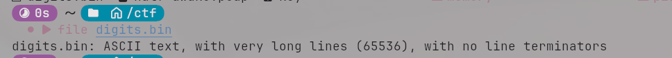
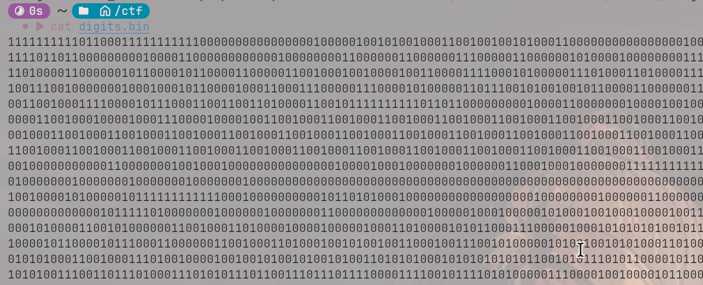
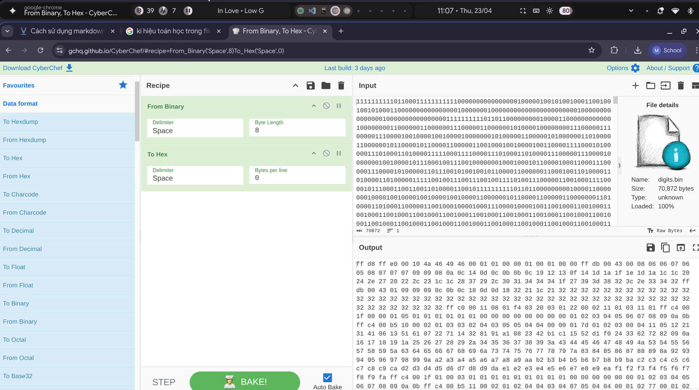
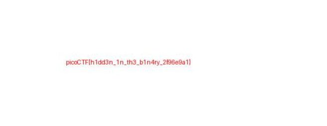

# [Write up Binary Digits](https://play.picoctf.org/practice/challenge/698?category=4&originalEvent=79&page=1)
### Writeup
----
### Description:
- This file doesn't look like much... just a bunch of 1s and 0s. But maybe it's not just random noise. Can you recover anything meaningful from this?
### Hint:
```
- None
```
---
#### Bước 1:
- Sử dụng wget để tải file về thư mục trong ubuntu.
#### Bước 2:
- File có định dạng là .bin
- Có các trường hợp có thể xảy ra nhất là file này là dạng file dữ liệu thô cần được chuyển định dạng hoặc dùng binwalk để điều tra theo dạng ổ dĩa hoăc.
- Vì thế đầu tiên ta phải dùng lệnh `file digits.bin` để xem file thuộc kiểu dữ liệu nào.

$\rightarrow$ Ta xác định được rằng đây chỉ là file text đơn thuần vì vậy ta thử `cat digits.bin` xem thử nội dung trong file là gì

$\Rightarrow$ Có thể thấy nội dung của file toàn các kí tự nhị phân, kết hợp với đoạn mô tả của đề bài, ta sẽ sử dụng cyberchef để decode xem đoạn mã nhị phân này thật sự ẩn chứa điều gì.
#### Bước 3: 

- Dựa vào kết quả mã hóa, ta nhận thấy được `header signature` là `ff d8...`
$\rightarrow$ Khả năng đây là nội dung thô của 1 file ảnh nào đó, do đó ta tiếp tục sử dụng công cụ [hex to image](https://codepen.io/abdhass/full/jdRNdj)
#### Bước 4:

- Kết quả thu được là flag của bài.

