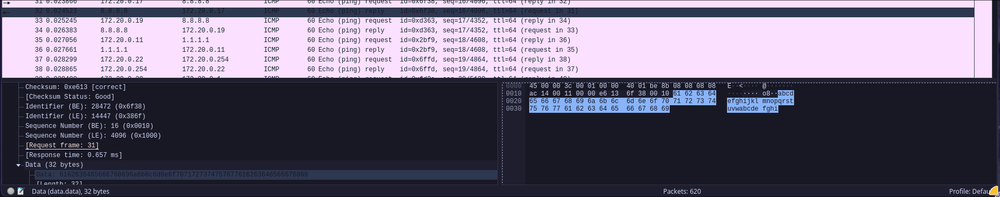
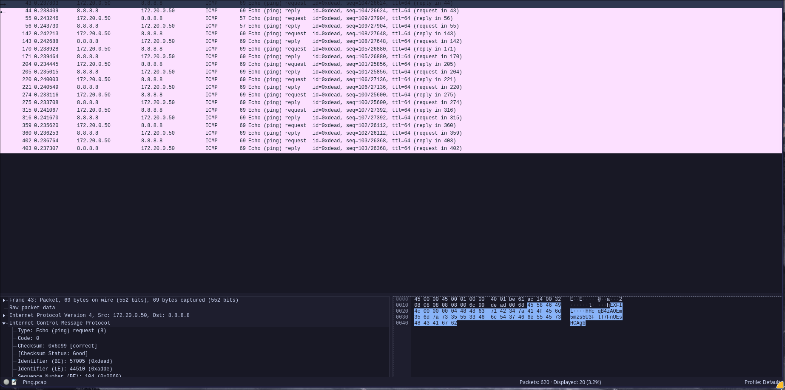
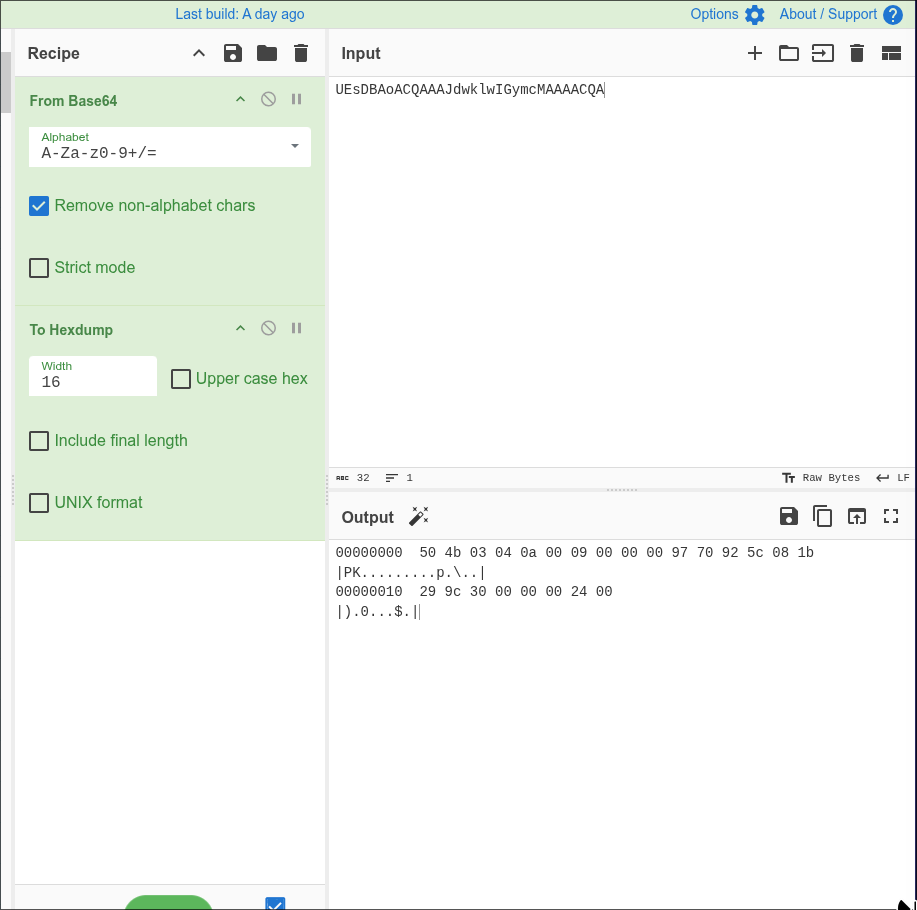
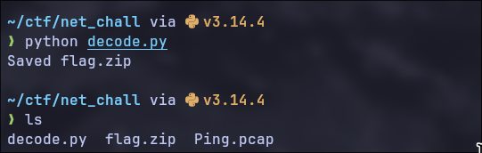

# [Write up Ping Net Challenge 2026](/home/minh/ctf/wucitief/PICOCTF/Forensics/Ping/Ping.pcap)
## Dạng bài có mức độ medium trong chủ đề Network_Forensics 
----
#### Description: 
- Nothing looked out of place in the dashboard. Outbound traffic appeared clean - just routine connectivity checks to a public DNS address. Everything within normal thresholds. But one analyst noticed those packets were slightly heavier than they should be. Just slightly. Just enough for nobody to notice.
#### Hint:
-  What "Netchallenge2026" is used for ?
----
### Write-up
- Ta được cung cấp 1 file .pcap nên ta sẽ sử dụng 'wireshark' để tiến hành phân tích.
- Dựa vào đoạn description, ta có thể đưa ra phỏng đoán điều tra ban đầu như sau:
    + Người dùng đang dùng lệnh gì đó để kiểm tra các kết nối đến 1 địa chỉ DNS công cộng. Khả năng dùng các lệnh `ping` hoặc `tracert` để kiểm tra lưu lượng đường truyền đến DNS nào đó
    + Người dùng đã lén truyền đi 1 thông điệp gì đó gần tương tự thông điệp do 2 lệnh được liệt kê ở trên để qua mặt hệ thống nhằm phát tán 1 loại dữ liệu nào đó.

- Dựa vào 2 phỏng đoán trên ta tiến hành kiểm tra trên wireshark. Ta nhận thấy các IP thuộc quản lí đang gửi request đến 2 địa chỉ DNS công cộng gồm `1.1.1.1` và `8.8.8.8`. Nội dung request xuất hiện nhiều nhất là `abcdefghijklmnopqrstuvwabcdefghi`


- Theo một số nguồn, thông điệp trên là thông điệp thường được dùng để kiểm tra kết nối và đường truyền của các host đến của DNS vì chúng có kích thước nhỏ. Như vậy theo phỏng đoán ban đầu, ta sẽ tìm các gói có data gửi đi khác với thông điệp ở trên thì sẽ thu được 1 vài manh mối nào đó.
- Sử dụng lệnh `icmp and !(icmp contains "abcdefghijklmnopqrstuvwabcdefghi")` để lọc các gói icmp có thông điệp khác với thông điệp ở trên thì ta thu được kết quả các gói tin như sau:


- Như vậy phỏng đoán của ta đã đúng, tiến hành đọc các gói icmp khác biệt đó thì thu được 1 số thông tin như sau:
    + Điểm chung của các thông điệp: bắt đầu bằng `EXFI`...
    + Theo sau đó là một chuỗi kí tự bao gồm các chữ các in hoa và in thường.

- Search thử trên mạng thì biết được rằng `EXFI` có thể là dấu hiệu của `Data Exfiltration (đánh cắp dữ liệu)`. Nhự vậy khả năng người dùng đã đánh dấu các thông tin đánh cắp được bằng cờ `EXFIL` và khả năng nội dung đằng sau `EXFIL` là nội dung đánh cắp bị phân mảnh.
 
- Sau khi sắp xếp gói tin được gửi theo thời gian và lấy nội dung của gói tin đầu tiên thì điều chúng ta cần có xuất hiện. `PK ...` là định dạng file signature của 1 file zip.
$\Rightarrow$ Chỉ cần gom các nội dung đằng sau `EXFIL` của các gói tin (sắp xếp theo thời gian được gửi đi) thành 1 file rồi chuyển thành định dạng zip.file thì sẽ thu được kết quả (Dùng AI nhờ viết script cho lẹ nhe \^.\^).
```python
import struct, base64, io, zipfile

with open('Ping.pcap', 'rb') as f:
    f.read(24)  # skip global header
    chunks = {}
    while True:
        hdr = f.read(16)
        if len(hdr) < 16: break
        ts_sec, ts_usec, incl_len, orig_len = struct.unpack('<IIII', hdr)
        data = f.read(incl_len)
        if len(data) < 20: continue
        ihl = (data[0] & 0x0f) * 4
        if data[9] != 1: continue  # only ICMP
        icmp = data[ihl:]
        if len(icmp) < 8: continue
        icmp_type = icmp[0]
        icmp_id = struct.unpack('>H', icmp[4:6])[0]
        payload = icmp[8:]
        if icmp_type == 8 and icmp_id == 0xDEAD and payload[:5] == b'EXFIL':
            idx = payload[8]
            chunks[idx] = payload[9:]

combined = b''.join(chunks[i] for i in sorted(chunks))
zip_data = base64.b64decode(combined)

with open('flag.zip', 'wb') as f:
    f.write(zip_data)
print("Saved flag.zip")
```
- Sau khi chạy đoạn script trên thì ta sẽ thu được file `flag.zip`

- Thử unzip thì file đòi mật khẩu :) . Lúc này chúng ta sử dụng hint mà đề bài cung cấp thì sẽ giải nén được. Cuối cùng cat `flag.txt` thì ta sẽ thu được flag.
##### Flag: `NET{1cmp_d4t4_3xf1ltr4t10n_succ3ss}`