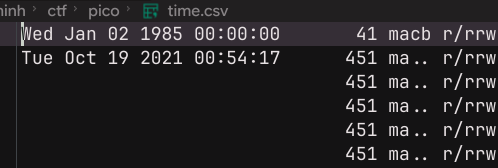

# [Write up Timeline 0](https://play.picoctf.org/events/79/challenges/720?category=4&page=1)
### Writeup
----
### Description:
- Can you find the flag in this disk image? Wrap what you find in the picoCTF flag format.
### Hint:
```
1. Create a Sleuthkit MAC timeline!
2. Sloppy timestomping can yield strange (very old) timestamps```
```
---
#### Bước 1:
- Sử dụng wget để tải file về thư mục trong ubuntu.
#### Bước 2:
- File có định dạng là .img.gz. 
- Dùng lệnh `file partition4.img.gz` để check loại file là gì. Thì file này là dạng nén của 1 file diskimage
#### Bước 3: 
- Dựa vào hint của bài, ta nhận thấy cần check timeline của các thư mục trong file disk này
- Để check timeline ta dùng :
`fls -r -m / partition4.img > partition4.body` để trích xuất đệ quy kèm đường dẫn toàn bộ dữ liệu vào 1 file tạm có tên là partition4.body.

- Tiếp tục, dùng lệnh mactime để trích thời gian trong file dữ liệu.
`mactime -b partition4.body > time.csv`

- Sau khi vào kiểm tra file time.csv ta thấy 1 điều bất thường

- Mốc thời gian 02/01/1985 hoàn toàn không khớp với các mốc thời gian được ghi nhận trong disk --> Đây chính là file mà hacker đã chèn vào máy tính của người dùng.

#### Bước 4:
- Sử dụng lệnh `binwalk -e partition4.img` để giải nén disk img. Ta tiến hành tìm thư mục đã ghi nhận ở bước 3. Ta nhận được 1 đoạn text được mã hóa base64. Tiến hành decode, ta sẽ nhận được flag.

